# Sprint 1 - Developing a DB and UI Prototype

## Sprint Goals

Develop a design for the database and a UI prototype that simulates the key functionality of the system. Test and refine the UI so that it can serve as the model for the next phase of development in Sprint 2.

### Specific Goals

- Design the database:
    - Tables
    - Fields / types
    - Primary keys
    - Default / nullable values
    - Relationships (foreign keys)
- Design the UI
    - Key pages
    - User interactions and 'flow'
    - Page layouts / features
    - Colour palette

## Initial Database Design

In the database, the user table holds data about the user, such as their names, instruments, password hash, and their usename. The week table holds data about the specific week, such as its date and practice date. These tables are linked to create a roster, represented by the roster table. They are also linked to create a table of when people are unavailable, represented by the unavailabilities table. Finally, the requests table stores requests made by users to change a time, and holds data of the date they need changes, the message they sent, and the id of the user who sent the request.

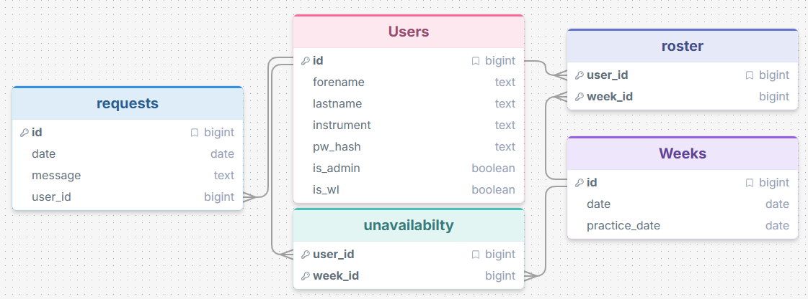

### Required Data Input

Users will initially input text data to create their account, and then every once in a while, they will input date type data to show unavailability. They will also need to input text and date data when making a request. Admin Users will need to input date data to create weeks, and text data to change people, and also add them to the roster.

### Required Data Output

Users will see text data (their names, instruments, and the names/instruments of others on at the same time), and date data (the date of the weeks they are playing). Admin will see text data (names and instruments in the roster, and while reviewing requests), and data data (date of weeks in roster, and when reviewing requests).

### Required Data Processing

Replace this text with a description of how the data will be processed to achieve the desired output(s) - any processes / formulae?

### Testing
 
I showed this database to my end-user, and they had some ideas. They thought that it would be good if people could have more than one instrument, as some people do multiple things, so they need to be able to be put on for multiple instruments. They also thought that the roles should be stored in a separate table, as users might have multiple roles.

### Changes / Improvements

Taking into account his suggestions, and created a new database design, with a new instruments and link table, and a new roles and link table.

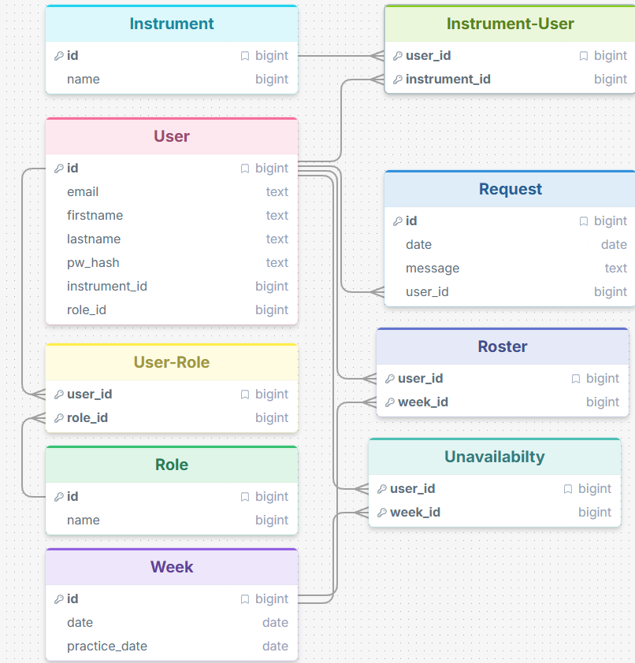

## UI 'Flow'

The first stage of prototyping was to explore how the UI might 'flow' between states, based on the required functionality.

[This](https://design.penpot.app/#/view?file-id=f0485fb1-4e63-8165-8008-3908f4b684e5&page-id=f0485fb1-4e63-8165-8008-3908f4b684e6&section=interactions&index=0&share-id=a234c67f-eb39-8116-8008-3f6be796e777) demo shows the initial design for the UI 'flow'.

### Testing

I showed this user flow to the main end user, and they had some ideas. They thought that the way to make rosters was a bit klunky, and thought it would be better if there was only one button, and users could input unavailability at any time. They also wanted to have a role that is in between admin and regular musician, like a week leader, that has a ll the functionality of a musician but can add files to a specific week, and can message the people that are on that week.

### Changes / Improvements

Because of this feedback, I improved the flow to include a more pages for a week leader to be able to be distingished from the regular users, and got rid of one of the roster creation pages, so it is simpler to use:

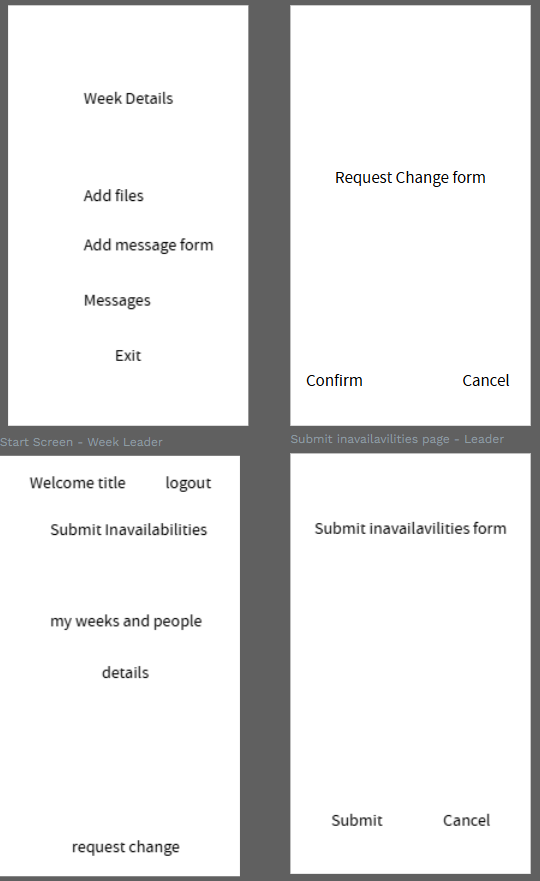

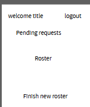

## Initial UI Prototype

The next stage of prototyping was to develop the layout for each screen of the UI.

[This](https://design.penpot.app/#/view?file-id=f0485fb1-4e63-8165-8008-3908f4b684e5&page-id=f0485fb1-4e63-8165-8008-3908f4b684e6&section=interactions&index=11) demo shows the initial design prototype for the UI.

### Testing

When I tested this design with my end user, I found a few bugs in my UI, such as some buttons not leading to the right place, for example, if a regular user tried to see the roster, it would take them back to the admin page when they exited.

### Changes / Improvements

I fixed these bugs, and made sure all my buttons work as intended. I also cleaned up a few other UI errors, like making sure buttons were centered and looked like buttons, and made sure everything was in a good layout that suited my project.

## Refined UI Prototype

Having established the layout of the UI screens, the prototype was refined visually, in terms of colour, fonts, etc.

For initial colour schemes, I gave my user a few options:

Blue:

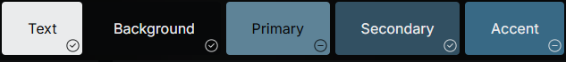

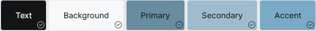

Bright Purple:

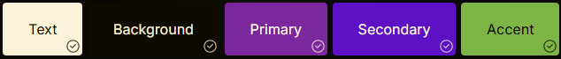

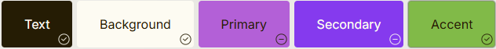

Earth:

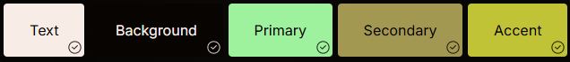

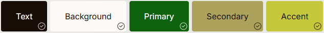

Slate:

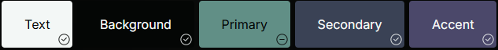

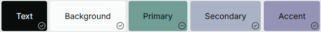

The end user thought that the blue colour scheme was the best color scheme, so I implemented this color scheme in the demo.

I also had a few font options for them to choose from:

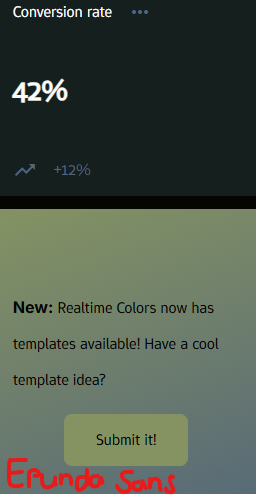
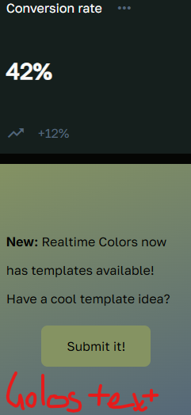

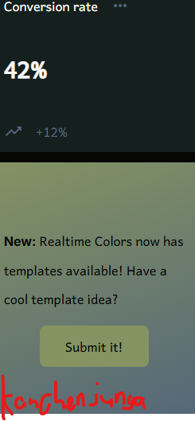
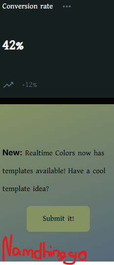

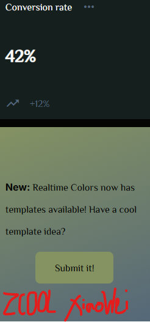

The end user liked Golos text and Epunda Sans the best, so I chose Epunda Sans as my font, and implemented it in the demo.

[This](https://design.penpot.app/#/view?file-id=8b1c6e78-ea22-8156-8008-63757c0fb0b8&page-id=f0485fb1-4e63-8165-8008-3908f4b684e6&section=interactions&index=0&interactions-mode=show-on-click&share-id=6f06cb60-262a-804c-8008-6c83824208d0) demo shows the UI with refinements applied.

### Testing

I talked to my end User, and they said that they liked the design, but would also love a desktop view for the admin user, and 

### Changes / Improvements

Replace this text with notes any improvements you made as a result of the testing.

*FIGMA IMPROVED REFINED PROTOTYPE - PLACE THE FIGMA EMBED CODE HERE - MAKE SURE IT IS SET SO THAT EVERYONE CAN ACCESS IT*

## Sprint Review

Replace this text with a statement about how the sprint has moved the project forward - key success point, any things that didn't go so well, etc.

