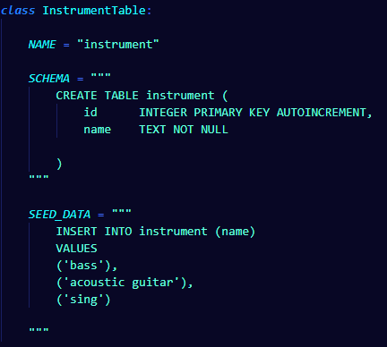
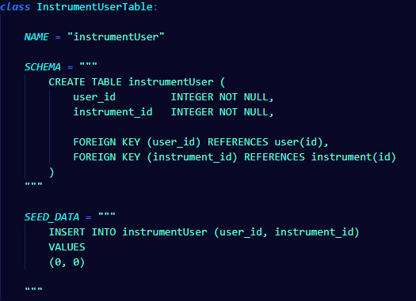
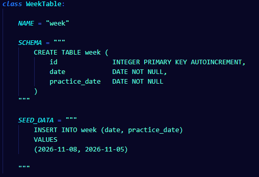
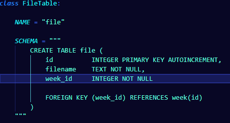
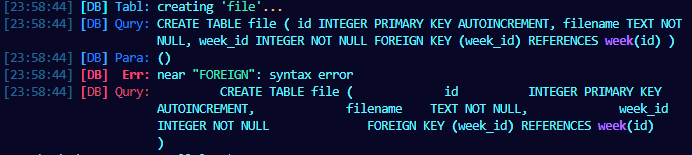
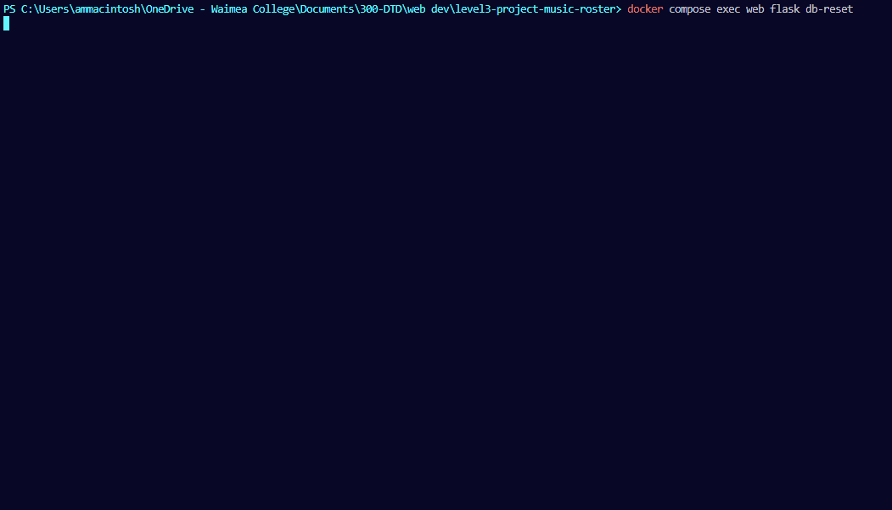

# Sprint 2 - Implement Database and Display of Test Data

## Sprint Goals

Implement the database, populated with test data. Create queries that retrieve test data, and display this on web pages as needed. Test and refine the queries and data display, so that it stands as the basis of the next sprint.

### Specific Goals

**Edit these goals as needed**

- Implement the database
- Add test data to the database
- Create the following web pages:
    - Home pages showing...
    - Details page for ...
    - Etc.
- Develop SQL database queries to:
    - Retrieve all ...
    - Retrieve specific ...
    - Etc.

## Testing Table Implementation with test data

I am testing to see wether the tables in my database are working, and can handle test data to get set up to work in the future. To test this, I put a few records in each table, and constructed the database.

Some example Schemas:

When I tested the table creation and seeding, there were many bugs. For example, there would often be an extra comma, or a missing value, and the table couldn't be created.
For example:

This led to an error, as a comma was missing after the last column in the table, so the computer couldn't handle the foreign key creation, and caused this error:

### Changes / Improvements

Because of this, I went through each table, one at a time, and made sure that there were no errors, and that when I recreated the DB, it would create and seed all the tables with no errors. This resulted in each table being able to be created, and handle data, as shown here:

## Testing FEATURE NAME HERE

Replace this text with notes about what you are testing, how you tested it, and the outcome of the testing

**PLACE SCREENSHOTS AND/OR ANIMATED GIFS OF THE TESTING HERE**

### Changes / Improvements

Replace this text with notes any improvements you made as a result of the testing.

**PLACE SCREENSHOTS AND/OR ANIMATED GIFS OF THE IMPROVED SYSTEM HERE**

## Testing FEATURE NAME HERE

Replace this text with notes about what you are testing, how you tested it, and the outcome of the testing

**PLACE SCREENSHOTS AND/OR ANIMATED GIFS OF THE TESTING HERE**

### Changes / Improvements

Replace this text with notes any improvements you made as a result of the testing.

**PLACE SCREENSHOTS AND/OR ANIMATED GIFS OF THE IMPROVED SYSTEM HERE**

## ETC...

## Sprint Review

Replace this text with a statement about how the sprint has moved the project forward - key success point, any things that didn't go so well, etc.

