# Sprint 2 - Implement Database and Display of Test Data

## Sprint Goals

Implement the database, populated with test data. Create queries that retrieve test data, and display this on web pages as needed. Test and refine the queries and data display, so that it stands as the basis of the next sprint.

### Specific Goals

**Edit these goals as needed**

- Implement the database
- Add test data to the database
- Create the following web pages:
    - Home pages showing...
    - Details page for ...
    - Etc.
- Develop SQL database queries to:
    - Retrieve all ...
    - Retrieve specific ...
    - Etc.

## Testing Table Implementation with test data

I am testing to see wether the tables in my database are working, and can handle test data to get set up to work in the future. To test this, I put a few records in each table, and constructed the database.

Some example Schemas:

When I tested the table creation and seeding, there were many bugs. For example, there would often be an extra comma, or a missing value, and the table couldn't be created.
For example:

This led to an error, as a comma was missing after the last column in the table, so the computer couldn't handle the foreign key creation, and caused this error:

### Changes / Improvements

Because of this, I went through each table, one at a time, and made sure that there were no errors, and that when I recreated the DB, it would create and seed all the tables with no errors. This resulted in each table being able to be created, and handle data, as shown here:

## Testing User Data Display

I am testing the display of all the data linked to one user. This is including data such as roles and instruments, which are stored in a separate table. I tested this by running a test query to see how it would handle retrieving data about a specific person. This will be useful later on, for implementing a session.

Table Contents:

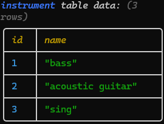 
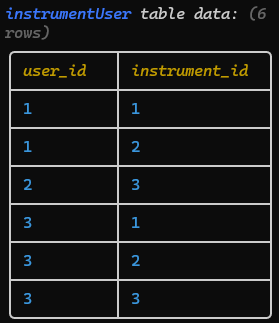 

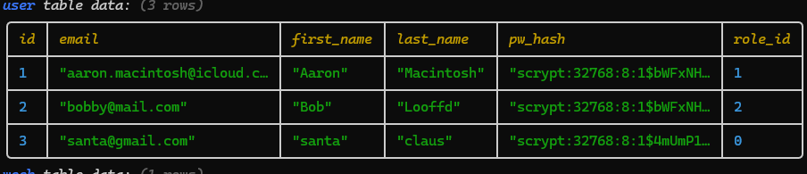 
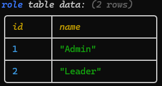

Display:

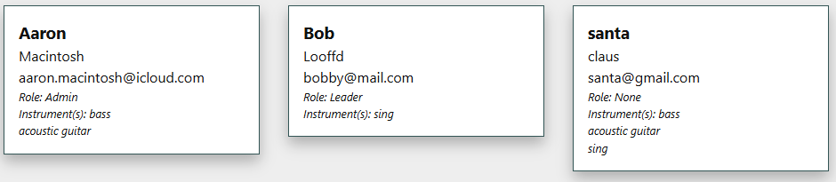

### Testing Outcome

As shown in the display, the correct data is displayed for each user, so the system can show the correct information when retrieving data about a user, which could be added to a session.

## Testing Roster display

I am testing the display of the roster. This is to see, with the test data I have put into the system, if it can display the full roster with every person and instrument in the correct week.

Using the following data, The roster returned should be:

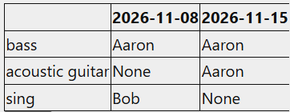

Table Contents:

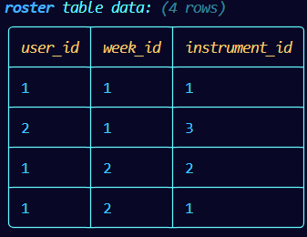

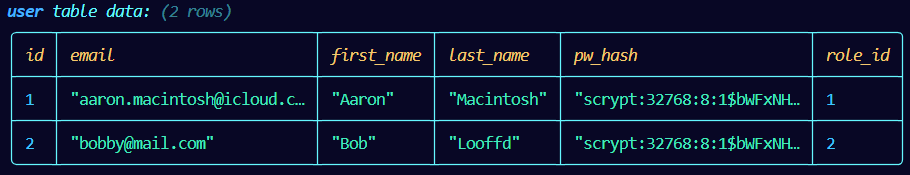
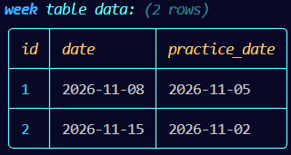

When I ran my algorithm (below), I kept getting an error, and when I fixed the error, it would return two empty lists, which is not what should happen.

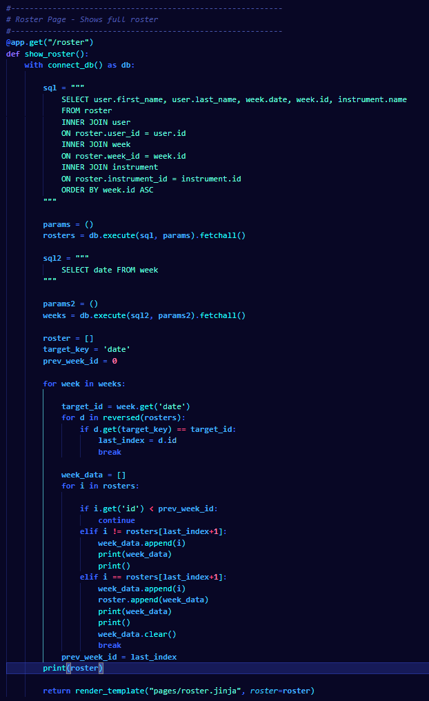

### Changes / Improvements

When this would not work, I came up with a new approach that was much simpler, and worked perfectly. This new SQL query makes use of a Cross Join to join the tables, which was something new that I hadn't learnt before, and would then loop through the data on the Jinja template to get the correct display.

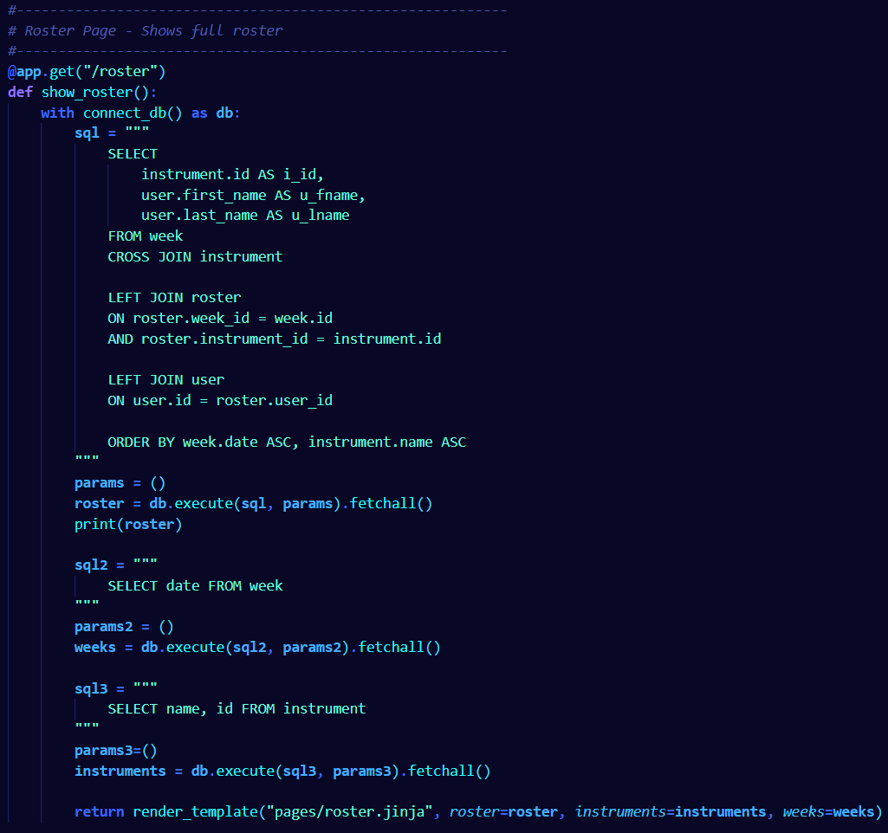

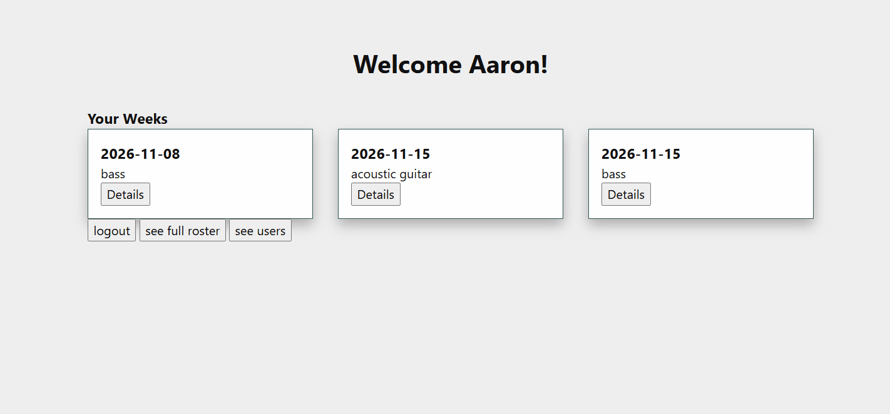

## Testing User Register (adding user to user table)

I am testing whether my app can add a user and all its associated data to the db. I tested this by getting my user register form, and inputting a test user. When this happened, everything worked as I intended it, and the correct tables were updated to show the new user.

Original user Table:

New User Table:

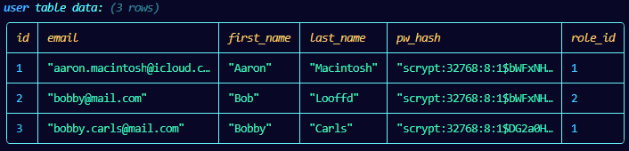

Instrument-User Table:

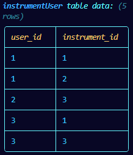

This resulted in the following card being displayed on the user list:

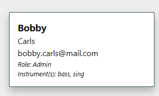

## Sprint Review

This sprint has moved my project forward, as it it has helped me to refine and finalize my database, and have a clear understanding of how my database will work, and be implemented into my system. Some things that went well: The implementation of my database with test data, Writing the roster display query and adding new users to the db. These went well, as they worked relatively quickly, and they all helped get my database to be displayed on my web app, and edited from the web app, which moved my project forward. One thing that did not go so well was that I had to refine my db a bit, as there were some things that I hadn't considered before, and I had to make changes that I weren't expecting, which was challenging to do.

